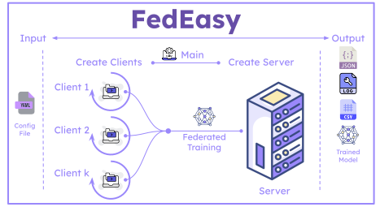

# FedEasy: Federated Learning With Ease




FedEasy is an intuitive, powerful yet simple to use Federated Learning framework built on top of [Flower](https://flower.ai/) and [PyTorch](https://pytorch.org/) frameworks. Our goal is to streamline the process of setting up and running federated learning experiments, making advanced machine learning techniques accessible to researchers and developers alike.

This repository provides an easy-to-use Federated Learning framework based on Flower and PyTorch. It is designed to simplify the process of setting up and running federated learning experiments.

> **Note**: This code has been written and tested on Ubuntu and should work seamlessly on any Linux-based distribution. Windows users may need to adjust some steps.

## 📋 Prerequisites

- Git
- Python 3.x
- pip (Python package installer)
- Miniconda (recommended for environment management)

## 🚀 Getting Started

Follow these steps to set up and use this repository:

### 1. Clone the Repository

```bash
git clone https://github.com/nclabteam/FedEasy.git
```
2. After cloning, navigate to the cloned directory and open the terminal.

3. Ensure `pip` is installed. If not, install it using:
```bash
 sudo apt install python3-pip
```

4. We will use Miniconda to create a virtual environment. Download Miniconda with: (*If you already have Conda installed, skip steps 4 and 5.*)

```bash
 curl https://repo.anaconda.com/miniconda/Miniconda3-latest-Linux-x86_64.sh -o Miniconda3-latest-Linux-x86_64.sh
```
5. Then install Miniconda using the command below:
```bash
  bash Miniconda3-latest-Linux-x86_64.sh
```
6. Create a new virtual environment using Conda:
```bash
 conda env create -f environment.yaml
```
This will create a virtual environment named `venv-fedeasy` based on the `environment.yaml` file.

7. Activate the virtual environment:
```bash
 conda deactivate
 conda activate venv-fedeasy
```
8. You can change the configuration as per your needs in the `config.yaml` file.

9. To scale clients to a few hundred, we can run Flower in simulation mode on a single machine like this:
```bash
python main.py
    or
python main.py --config /path/to/config.yaml
```
  This script reads the configuration from the `config.yaml` file and starts the simulation.

  The outputs will be saved in the `out` directory.


## 🔧 Description about  [`config.yaml`](/config.yaml) file
The `config.yaml` file is the configuration file used to train a Federated Learning model with this framework.

It is divided into three sections: `common`, `server`, and `client`.

### Common Section
The `common` section contains the common configurations used in this framework. 

- `data_type` : This field specifies the data distribution type used in the training process. Currently supported data distributions are [`iid`,`dirichlet_niid`]. Detailed explination can be found [here](./docs/data_distribution.md).
- `dataset` : This field specifies the dataset used in the training process. Currently supported datasets are [`mnist`, `cifar10`, `cifar100`,`fashion_mnist`, `sasha/dog-food`, `zh-plus/tiny-imagenet`]. Detailed explination can be found [here](./docs/datasets.md).
- `dirichlet_alpha` : This field is used when `data_type` is set to `dirichlet_niid`. It specifies the Dirichlet concentration parameter.
- `target_acc` : This field specifies the target accuracy the model should achieve (must be `> 0`).
- `model` : This field specifies the model architecture used in the training process. Currently implemented models are [ `Net`, `CifarNet`, `SimpleCNN`, `KerasExpCNN`, `MNISTCNN`, `SimpleDNN`, `FMCNNModel`,`FedAVGCNN`,`Resnet18`, `Resnet34`,`ResNet18Pretrained`, `ResNet34Pretrained`,`ResNet18Small`, `ResNet20Small`,`MobileNetV2`,`EfficientNetB0`,`LSTMModel`]. Detailed explination can be found [here](./docs/models.md).
- `optimizer` : This field specifies the optimizer used in the training process. It could be either `sgd` or `adam`.
- `seed` : This field fixes the seed for reproducibility.

### Server Section
The `server` section contains the configurations for the server that coordinates the Federated Learning process.

- `max_rounds` : This field specifies the maximum number of rounds for the training process.
- `address` : This field specifies the IP address of the server.
- `num_clients` : This field specifies the total number of clients participating in training.
- `fraction_fit` : This field specifies the fraction of participating clients used for training in each round.
- `min_fit_clients` : This field specifies the minimum number of participating clients required for training in each round.
- `fraction_evaluate` : This field specifies the fraction of participating clients used for evaluation in each round.
- `min_avalaible_clients` : This field specifies the minimum number of clients that should be available for the training process.
- `strategy` : This field specifies the strategy used for Federated Learning. Currently supported strategies are [`FedLaw`, `FedProx`, `FedAvgM`, `FedOpt`, `FedAdam`, `FedMedian`, `FedAvg`]. Detailed explanation can be found [here](./docs/strategies.md).

### Client Section
The `client` section contains the configurations for the clients participating in the Federated Learning process.

- `epochs` : This field specifies the number of epochs for each client's training process.
- `batch_size` : This field specifies the batch size for each client's training process.
- `lr` : This field specifies the learning rate for each client's training process.
- `save_train_res` : This field specifies whether to save the training results. If `true`, saves training results (accuracy, loss, time, etc.) to the `out` directory.
- `total_cpus` : Number of CPU cores assigned for the whole simulation.
- `total_gpus` : Number of GPUs assigned for the whole simulation.
- `gpu` : `true` or `false`, use GPU for training or not. Default to `false`.
- `num_cpus` : Number of CPU cores assigned for each client. The default is `1`.
- `num_gpus` : Fraction of GPU assigned to each client. (num_cpus and num_gpus can only be used in simulation mode if `simulation` is set to `true`).

  For more details on simulation mode, please refer to [Flower's simulation guide](https://flower.dev/docs/framework/how-to-run-simulations.html) and [Ray's scheduling documentation](https://docs.ray.io/en/latest/ray-core/scheduling/resources.html).


### Code Formatting
# Installation
```
pip install isort black
```
# Usage
```
isort mak --profile=black
black mak
```
Or run:
```
bash code_formatting.sh
```

## 📖 Citation

If you use FedEasy in your research, please cite our work:

```bibtex
@software{FedEasy2025,
  author = {Kundroo, Majid and Haider, Ghani and Khoa, Nguyen and Mamond, Abdul Wahab and Kim, Taehong},
  title = {FedEasy: Federated Learning With Ease},
  year = {2025},
  url = {https://github.com/nclabteam/FedEasy},
  version = {1.0.0}
}
```
